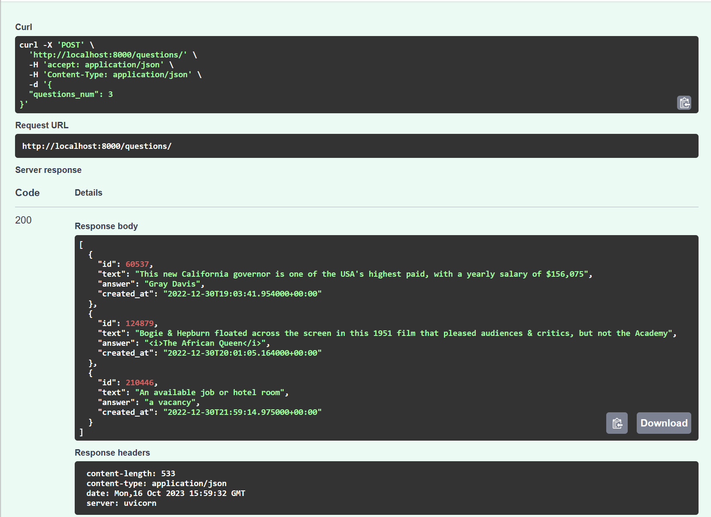

# API for getting questions
The repository contains docker-compose.yml file for 
deploying app in one click

### List of used images

- Database: PostgreSQL 15.3 on external port 5435
- App: python 3.11 that runs on port 8000

### Requirements

- Docker
- Internet connection

### Installation

Run the following command to create and run containers of the app
> docker compose up

After all containers being created and started you can access the application
on following address: http://loclalhost:8000/docs

### Example of request

